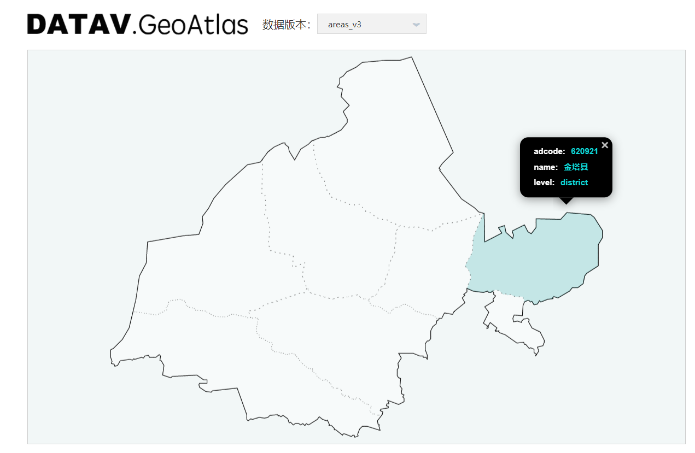
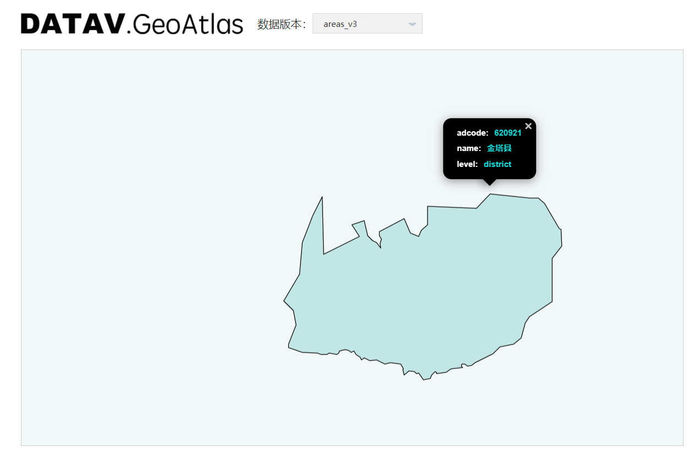

# Echarts-Map-Json
- Echarts地图使用的JSON文件文件，从国家开始
- 数据来源：https://datav.aliyun.com/tools/atlas/index.html
- `tree_format_all` 文件相当于整个树的目录,自行爬虫获取整个树结构文件
- 叶子节点的地图一般只有外部轮廓，比如区县，只有区县的轮廓，看不到区县里面的城镇轮廓，如下图

